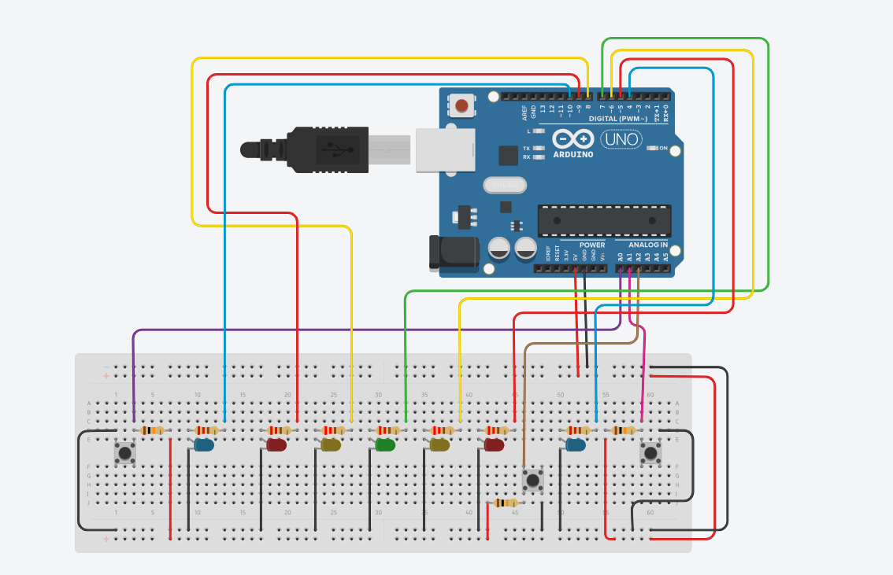

# Reaction Speed Game (2-Player)

An Arduino-based game that tests player reaction time. When the **Start button** is pressed, a series of LEDs light up **(Red -> Yellow -> Green)**.Then, after a **random delay(1-5 seconds)**, all LEDs turn off. The first player to press their button wins and a blue LED + celebration animation runs.

---

## Components Used

- Arduino Uno
- 3 push buttons (Start, Player 1 and Player 2)
- 5 LEDS (2 Red, 2 Yellow and 1 Green)
- 2 Blue LEDs (Player 1 and Player 2 winner indication)
- Resistors ( 220&Omega; for LEDs, 10k&Omega; for buttons)
- Breadboard and Jumper Wires

---

## Working Logics

1. Press **Start button**
2. LEDs sequence : Red -> Yellow -> Green
3. Random delay (1 - 5 seconds)
4. All LEDs turn off
5. Player presses button:
   - Blue LED infront of player lights up
   - Celebration animation runs
6. Game resets after 3 seconds

---

## Code Used

[See 'reaction_speed_game.ion' in this repo.](reaction_speed_game.ion)

---

## Circuit Diagram

---

## Skills Gained

- Reaction game logic
- Use of 'random()' function
- LED sequencing
- Button handling with debouncing
- Celebration animation pattern
- Event-driven programming

---

Created by **Aryan Patil**.
